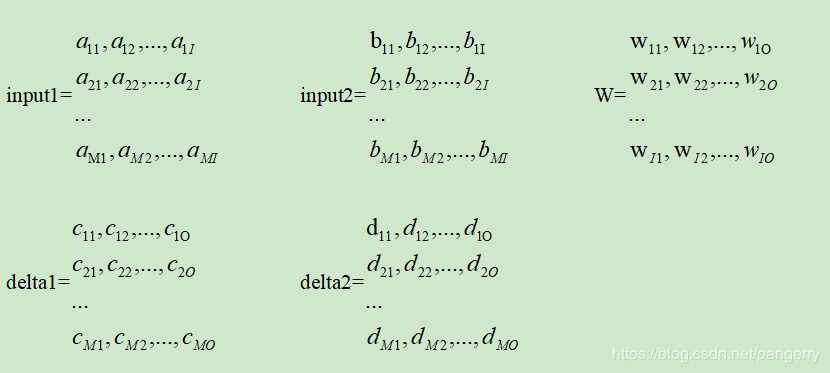
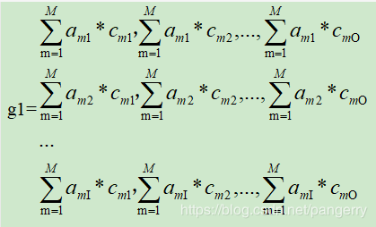
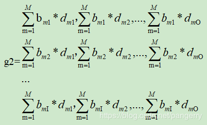
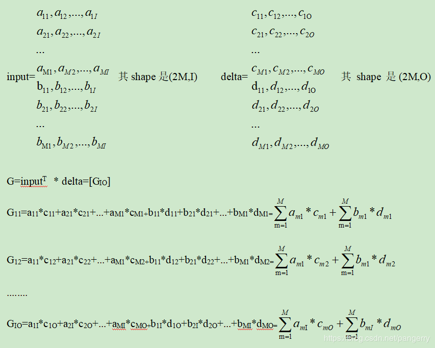
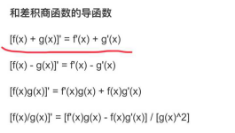

本文作者：[gerry] # 概要：设input1和input2是shape为(M,I)的张量，权重W是shape为(I,O)的张量,
设对应的两个输出值为output1和output2，其shape是(M,O)，设损失函数对输出值的导数为epsilon1和epsilon2，损失函数对线性部分的导数为delta1和delta2，shape也都是(M,O)：
<!-- more -->

设input1和input2是shape为(M,I)的张量，权重W是shape为(I,O)的张量,
设对应的两个输出值为output1和output2，其shape是(M,O)，设损失函数对输出值的导数为epsilon1和epsilon2，损失函数对线性部分的导数为delta1和delta2，shape也都是(M,O)：

**Nd4j.gemm(input, delta, weightGrad, true, false, 1.0, 0.0);**

以全连接为例，已知gradient=input^T  * delta
权重梯度gradient的shape和权重W相同，shape=(I,O)
得到（注意看逗号）：

对input1和input2合并，即沿着dimension=0合并，新的input和delta如下：

此处发现**G=g1+g2**
同理可推，当有n个input时，**G=g1+g2+...+gn**

**1.gn的意义：**
L=L1+L2+...+Ln

**2.G的意义：**
将n个input合并为一个Input，视为一个整体，直接计算权重W的梯度G，而G的值正是等于每个单独计算的梯度的总和。

**综上所述，只要对n个输入沿着dimension=0合并成新的input进入其他Layer，既能做到前向传播时权重W被共用，又能做到反向传播时梯度符合“和函数的导数”。**

偏差bias的梯度同理。

Deeplearning4j中的实现类：
org.deeplearning4j.nn.conf.graph.StackVertex
org.deeplearning4j.nn.graph.vertex.impl.StackVertex
StackVertex是对n个输入沿着dimension=0合并。合并之后新的input就能进入ff层、RNN层或CNN层进行参数共享和反向梯度计算。