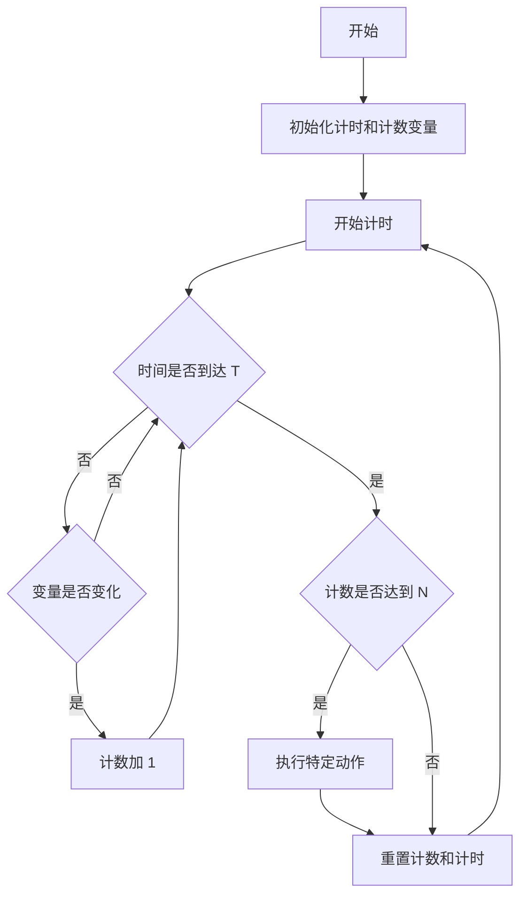

本文作者：[wangwenhai] # 概要：本文详细介绍了一种计时执行策略。

<!-- more -->
即在特定的时间间隔 `T` 内，当某个变量积累的次数达到 `N` 时，触发执行一个特定动作。文中给出了该策略的设计思路、流程图以及对应的 C 语言示例代码，有助于开发者在实际项目中应用此策略。


# 一种区间计时执行策略

## 摘要
本文详细介绍了一种计时执行策略，即在特定的时间间隔 `T` 内，当某个变量积累的次数达到 `N` 时，触发执行一个特定动作。文中给出了该策略的设计思路、流程图以及对应的 C 语言示例代码，有助于开发者在实际项目中应用此策略。

## 一、引言
在许多实际的编程场景中，我们常常需要根据一定的时间条件和计数条件来触发特定的动作。例如，在工业控制中，需要在一段时间内统计某个传感器的触发次数，当次数达到一定阈值时，执行相应的控制操作；在游戏开发中，可能需要在一定时间内统计玩家的某种操作次数，达到规定次数后触发特殊事件。本文提出的计时执行策略能够很好地满足这类需求。

## 二、计时执行策略设计思路
该策略的核心思想是在一个固定的时间间隔 `T` 内，对某个变量的变化次数进行统计。当统计次数达到预设的阈值 `N` 时，执行一个预先定义好的动作。具体步骤如下：
1. 初始化计时和计数变量。
2. 开始计时，并在每次变量发生变化时增加计数。
3. 在时间间隔 `T` 结束时，检查计数是否达到阈值 `N`。
4. 如果达到阈值，则执行特定动作；否则，重置计数并开始下一个时间间隔的统计。

## 三、流程图


## 四、C 语言示例代码
```c
#include <stdio.h>
#include <time.h>

#define T 5  // 时间间隔，单位：秒
#define N 10 // 计数阈值

// 模拟变量变化检测函数
int is_variable_changed() {
    // 这里可以根据实际情况实现变量变化检测逻辑
    // 为了示例，我们简单地随机返回 0 或 1
    return rand() % 2;
}

// 模拟特定动作执行函数
void perform_action() {
    printf("达到条件，执行特定动作！\n");
}

int main() {
    time_t start_time, current_time;
    int count = 0;

    while (1) {
        start_time = time(NULL);  // 记录开始时间
        count = 0;  // 重置计数

        while (1) {
            current_time = time(NULL);
            if (current_time - start_time >= T) {  // 时间到达 T
                if (count >= N) {  // 计数达到 N
                    perform_action();
                }
                break;
            }

            if (is_variable_changed()) {
                count++;
            }
        }
    }

    return 0;
}
```

## 五、代码解释
1. **宏定义**：`T` 定义了时间间隔，`N` 定义了计数阈值。
2. **is_variable_changed 函数**：模拟变量变化检测，实际应用中需要根据具体情况实现该函数的逻辑。
3. **perform_action 函数**：模拟特定动作的执行，在实际应用中可以替换为具体的操作。
4. **main 函数**：
    - 初始化计时和计数变量。
    - 进入一个无限循环，每次循环开始时重置计时和计数。
    - 在时间间隔 `T` 内，不断检查变量是否变化，若变化则增加计数。
    - 当时间到达 `T` 时，检查计数是否达到 `N`，若达到则执行特定动作。
