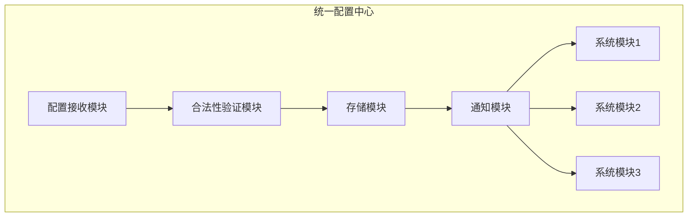
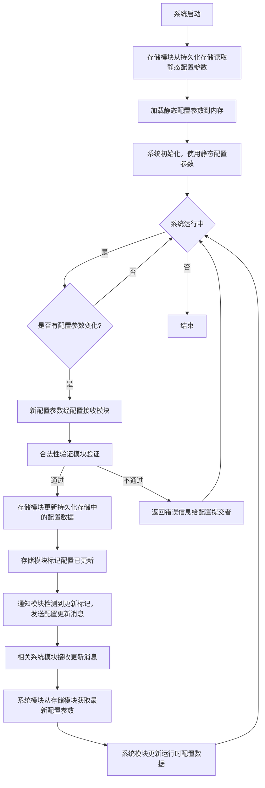

本文作者：[wangwenhai] # 概要：统一嵌入式 Linux 配置中心
<!-- more -->

---


# 统一嵌入式 Linux 配置中心

## 摘要

在嵌入式 Linux 软件开发领域，配置管理的高效性与稳定性至关重要。本文针对当前配置分散、模块耦合度高的问题，精心设计了一个低耦合的统一配置中心。该配置中心能够集中管理各类配置参数，如 IP 地址、WIFI 账号等，涵盖了参数合法性验证、持久化存储以及实时通知系统模块执行等关键功能，有效提升了系统的可维护性与可扩展性。特别在静态配置和运行时配置同步方面，提出了创新的机制，确保系统在不同运行状态下配置的一致性和实时性。通过 Python 配置网络的实例，进一步验证了该设计在实际应用中的有效性和可行性，为嵌入式 Linux 系统开发提供了极具价值的解决方案。

## 一、引言

在嵌入式 Linux 系统不断发展的过程中，随着功能的日益丰富，配置参数和相关模块的数量急剧增加。传统的每个模块各自拥有独立配置数据库或文件的模式，导致配置管理变得极为复杂，模块之间的耦合度居高不下，给系统的维护和升级带来了巨大挑战。设计一个统一的配置中心，实现配置管理的集中化，能够有效降低模块间的耦合程度，显著提高系统整体的稳定性、可维护性和可扩展性。而在这一过程中，实现静态配置（系统启动前已存储在持久化介质中的配置）和运行时配置（系统运行过程中动态更新的配置）的同步，对于确保系统稳定运行、及时响应配置变化具有至关重要的意义。

## 二、需求分析

### 2.1 配置参数管理

需要对多种类型的配置参数进行全面管理，包括网络配置（如 IP 地址、子网掩码、网关、WIFI 账号和密码等）、VPN 配置（服务器地址、用户名、密码等）以及其他各类应用相关的配置参数。通过定义统一的数据结构和接口，实现对这些参数的集中添加、修改和查询操作，方便用户对配置进行统一管理与维护，提高配置管理的效率和便捷性。

### 2.2 合法性验证

配置中心在接收配置参数后，必须依据各类配置参数的标准规范，对其合法性进行严格验证。例如，对于 IP 地址，要验证其是否符合 IPv4 或 IPv6 的地址格式规范；对于 WIFI 账号和密码，要检查其长度和字符组成是否符合要求；对于 VPN 配置参数，要确保服务器地址的有效性、用户名和密码的合规性等。只有通过合法性验证的参数，才能进入后续的存储和应用流程，以确保系统配置的准确性、稳定性和安全性。

### 2.3 存储机制

合法的配置参数需保存到持久化存储中，如 SQLite 数据库、JSON 格式的配置文件或其他适合嵌入式系统的存储介质。利用文件系统或数据库管理系统提供的接口，将配置数据以特定格式写入存储介质，并在系统启动时，通过相应的读取接口将配置数据读入内存，供系统初始化和运行时使用。同时，要考虑存储的可靠性和读写效率，确保配置数据的安全存储和快速读取。

### 2.4 通知机制

当配置参数发生更新时，配置中心要能够及时、准确地通知相关的系统模块，使其获取最新的配置并执行相应的操作。采用消息队列、信号量或发布 - 订阅模式等高效的通信机制，实现配置中心与系统模块之间的实时通信。以消息队列为例，配置中心将配置更新消息发送到消息队列，相关系统模块订阅该队列，一旦有新消息，模块即可获取并处理；信号量则是配置中心发送特定信号，系统模块监听该信号，接收到信号后执行相应操作。通过这些机制，确保系统各模块间的协同一致性，及时响应配置变化。

## 三、设计目标

### 3.1 低耦合

配置中心与各个系统模块之间保持较低的耦合度，通过定义清晰、独立的接口，使它们之间仅通过接口进行交互，避免直接的代码依赖。这样，当某个模块进行修改、升级或替换时，对其他模块的影响将降至最低，从而提高系统的可维护性和可扩展性，方便系统的长期演进和维护。

### 3.2 集中管理

实现对所有配置参数的集中式管理，将各类配置信息整合在一处，采用统一的数据结构和存储方式进行存储和管理。这样可以避免配置分散带来的管理难题，提高配置管理的效率和一致性，便于进行统一的维护、监控和管理操作。

### 3.3 高效通知

设计一套高效的通知机制，采用异步通信机制，如消息队列，减少通知过程中的等待时间，确保系统模块能够在第一时间获取到最新的配置信息，并迅速执行相应操作。通过这种方式，保障系统的实时性和响应速度，及时适应配置变化，提高系统的整体性能。

## 四、整体架构设计

### 4.1 架构图




### 4.2 模块说明

**配置接收模块**：负责接收来自外部的配置参数，接收途径包括命令行接口、网络接口、图形化界面等。利用操作系统提供的输入输出接口，监听相应的输入源，获取配置参数后，按照预定的数据结构进行解析和整理，再将其传递给合法性验证模块，开启后续的配置处理流程。

**合法性验证模块**：针对不同的配置类型，编写相应的验证函数和规则集，依据配置规范对接收的配置参数进行逐一验证。如果参数合法，将其传递给存储模块；如果不合法，及时返回详细的错误信息给配置提交者，提示其进行修正，确保进入存储和应用环节的配置参数都是准确有效的。

**存储模块**：将通过合法性验证的配置参数保存到持久化存储中，如 SQLite 数据库或 JSON 格式的配置文件。在系统启动时，从存储中读取配置参数，为系统初始化提供必要的数据支持。利用数据库驱动或文件操作函数，实现配置数据的高效写入和读取，并确保数据的完整性和一致性。

**通知模块**：当存储模块中的配置参数发生更新时，通知模块迅速响应，采用消息队列、信号量等机制，将配置更新消息发送给相关的系统模块。以消息队列实现为例，利用消息队列中间件提供的 API，将配置更新消息发送到指定队列，系统模块通过订阅该队列获取更新消息，确保系统模块能够及时得知配置的变化并做出相应处理。

## 五、关键流程

### 5.1 配置提交流程

**提交配置**：用户或其他模块通过配置接收模块提交配置参数，配置接收模块利用操作系统提供的接口，从各种输入源获取配置参数，并进行初步的解析和整理。

**验证参数**：合法性验证模块依据预先定义的验证规则和函数，对提交的参数进行严格验证，判断其是否符合各类配置参数的规范要求。

**存储参数**：如果参数合法，存储模块通过调用数据库或文件操作接口，将其保存到持久化存储中，确保配置数据的永久性保存。

**通知模块**：存储模块在完成存储后，通过共享内存标志位、消息队列消息等方式，及时通知通知模块配置已更新，触发后续的通知流程。

**模块更新**：通知模块利用消息队列或信号量等机制，将更新消息发送给相关系统模块。系统模块接收到消息后，从存储模块获取最新配置，并依据新配置执行相应操作，完成配置的应用和更新。

### 5.2 配置查询流程

**发起查询**：系统模块或用户根据需求，通过调用配置中心提供的查询接口，发送查询请求及相关查询参数，请求获取所需的配置信息。

**查询存储**：存储模块接收到查询请求后，根据查询请求，利用数据库查询语句或文件读取函数，从存储介质中准确读取相应的配置参数。

**返回结果**：将读取到的查询结果按照预定的数据格式进行整理和封装，返回给查询发起者，满足其查询需求。

## 六、静态配置和运行时配置同步原理

系统启动时，存储模块从持久化存储中读取静态配置参数，加载到内存中，供系统初始化使用。在系统运行过程中，当配置参数发生变化时，新的配置参数首先经过配置接收模块、合法性验证模块，验证通过后由存储模块更新持久化存储中的配置数据。同时，存储模块会标记配置已更新，通知模块检测到更新标记后，将配置更新消息发送给相关系统模块。系统模块接收到更新消息后，从存储模块重新获取最新的配置参数，更新自身在运行时使用的配置数据，从而实现静态配置和运行时配置的同步。为了确保数据一致性，在更新持久化存储和内存中的配置数据时，采用事务处理机制或数据版本控制机制，避免数据不一致问题。具体来说，事务处理机制保证在更新过程中，要么所有相关数据都成功更新，要么都回滚到原始状态；数据版本控制机制则通过为每次配置更新分配版本号，在更新时检查版本号，确保更新的是最新版本的数据，防止数据冲突和不一致。

### 6.1 静态配置和运行时配置同步流程图




## 七、伪代码描述

### 7.1 配置接收模块


```python
def receive_config(config):

# 接收配置参数，可能从命令行、网络等获取

# 示例：假设从网络接收JSON格式数据并解析为字典

import json

if isinstance(config, str):

    config = json.loads(config)

validate_config(config)
```

### 7.2 合法性验证模块


```python
def validate_config(config):

if is_valid_ip(config['ip']):

    save_config(config)

else:

    print("IP地址不合法")

def is_valid_ip(ip):

parts = ip.split('.')

if len(parts)!= 4:

    return False

for part in parts:

    if not part.isdigit() or int(part) < 0 or int(part) > 255:

        return False

return True
```

### 7.3 存储模块


```python
import sqlite3

import json

def save_config(config):

# 保存到SQLite数据库示例

conn = sqlite3.connect('config.db')

cursor = conn.cursor()

cursor.execute('''

    INSERT INTO config (config_key, config_value) VALUES (?,?)

    ON CONFLICT(config_key) DO UPDATE SET config_value =?

''', (config['key'], json.dumps(config['value']), json.dumps(config['value'])))

conn.commit()

conn.close()

update_notify()

def load_config(key):

conn = sqlite3.connect('config.db')

cursor = conn.cursor()

cursor.execute('SELECT config_value FROM config WHERE config_key =?', (key,))

result = cursor.fetchone()

conn.close()

if result:

    return json.loads(result[0])

return None
```

### 7.4 通知模块


```python
import pika

def update_notify():

connection = pika.BlockingConnection(pika.ConnectionParameters('localhost'))

channel = connection.channel()

channel.queue_declare(queue='config_updates')

channel.basic_publish(exchange='', routing_key='config_updates', body='Config updated')

connection.close()
```

## 八、Python 配置网络实例

以配置 IP 地址为例，假设我们已经搭建好了统一配置中心，并且配置中心提供了相应的接口供外部调用。以下是使用 Python 实现完整 IP 配置到成功或者失败过程的示例代码，该示例代码展示了如何通过配置中心来完成网络配置操作，进一步体现统一配置中心在实际应用中的作用。


```python
import subprocess

import sys

# 模拟从配置中心获取配置接口

def get_config_center_interface():

# 此处模拟实际获取配置中心接口对象的过程，简化为返回一个模拟接口对象

class MockConfigCenter:

    def receive_config(self, config):

        print(f"配置中心接收配置: {config}")

        # 模拟实际调用配置接收模块逻辑，对配置进行后续处理

        return self.validate_and_configure(config)

    def validate_and_configure(self, config):

        ip = config.get('ip')

        if not self.validate_ip(ip):

            print(f"IP地址 {ip} 不合法")

            return False

        result = self.configure_network(ip)

        if result:

            print(f"IP地址 {ip} 配置成功")

        else:

            print(f"IP地址 {ip} 配置失败")

        return result

    def validate_ip(self, ip):

        # 将IP地址按点号分割成四个部分

        parts = ip.split('.')

        # 检查是否为四个部分

        if len(parts)!= 4:

            return False

        for part in parts:

            # 检查每个部分是否为数字，且在0到255之间

            if not part.isdigit() or int(part) < 0 or int(part) > 255:

                return False

        return True

    def configure_network(self, ip):

        try:

            # 以Linux系统的ip命令为例，使用subprocess.run执行系统命令配置IP地址

            #'sudo' 用于获取管理员权限，'ip addr add' 是添加IP地址的命令

            # ip 是要配置的IP地址，'dev eth0' 表示配置到eth0网络接口

            subprocess.run(['sudo', 'ip', 'addr', 'add', ip, 'dev', 'eth0'], check=True)

            return True

        except subprocess.CalledProcessError:

            # 捕获命令执行过程中的异常，若执行失败，返回False

            return False

return MockConfigCenter()

# 配置IP地址的函数

def configure_ip(ip_address):

config_center = get_config_center_interface()

config = {

    "config_type": "network",

    "sub_type": "ip",

    "ip": ip_address

}

# 将配置信息传递给配置中心，触发配置流程，并返回配置结果

return config_center.receive_config(config)

if __name__ == "__main__":

new_ip = "192.168.1.100"

success = configure_ip(new_ip)

if success:

    # 配置成功，程序正常退出

    sys.exit(0)

else:

    # 配置失败，程序以错误状态退出

    sys.exit(1)
```

在上述代码中：

`get_config_center_interface` 函数用于模拟获取配置中心接口。返回的 `MockConfigCenter` 类中包含 `receive_config` 方法，该方法会调用 `validate_and_configure` 方法。`validate_and_configure` 方法首先对传入的 IP 地址进行合法性验证，验证通过后调用 `configure_network` 方法进行实际的网络配置操作。

`validate_ip` 方法依据标准的 IP 地址格式规范，对输入的 IP 地址进行验证，判断其是否合法，确保后续配置操作基于正确的 IP 地址进行。

`configure_network` 方法使用 `subprocess.run` 函数调用 Linux 系统的`ip`命令来配置 IP 地址。如果命令执行过程中没有出现错误（即没有抛出`subprocess.CalledProcessError`异常），则表示配置成功，返回`True`；否则，捕获异常并返回`False`表示配置失败。

`configure_ip` 函数负责获取配置中心接口，构建包含配置类型、子类型和具体 IP 地址的配置字典，然后将该字典传递给配置中心的`receive_config`方法，以此触发整个配置流程，并接收和返回配置结果。

通过这个完整的示例，可以清晰地看到在统一配置中心的架构下，从 IP 地址的提交、合法性验证，到实际配置操作以及最终结果反馈的全过程。这一过程确保了配置的准确性和系统的稳定性，在实际应用中，配置中心的各个模块将严格按照论文中设计的原理和流程协同工作，共同完成网络配置任务。
